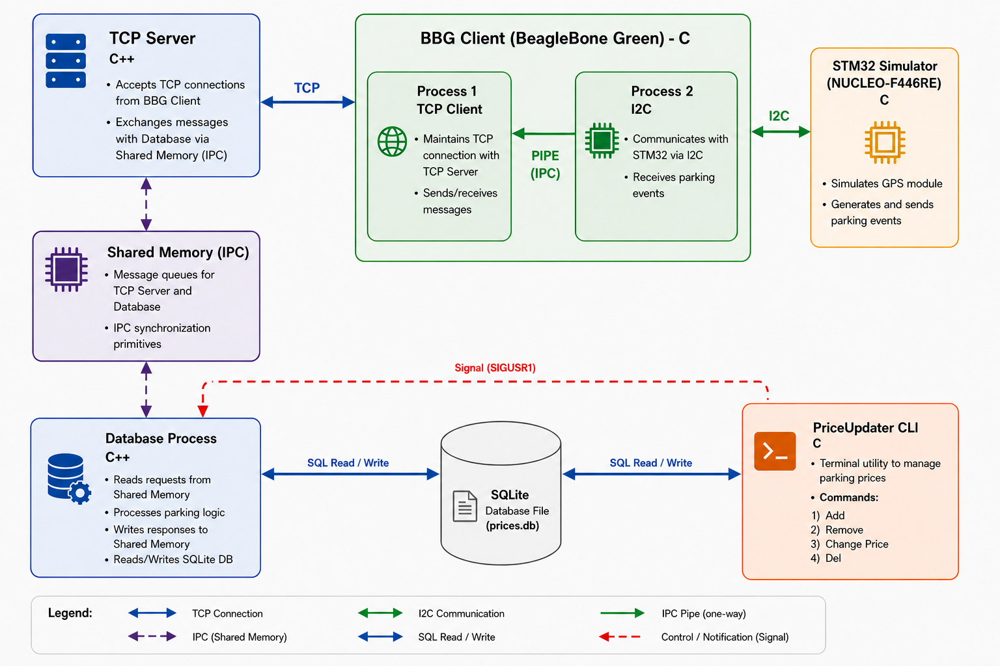
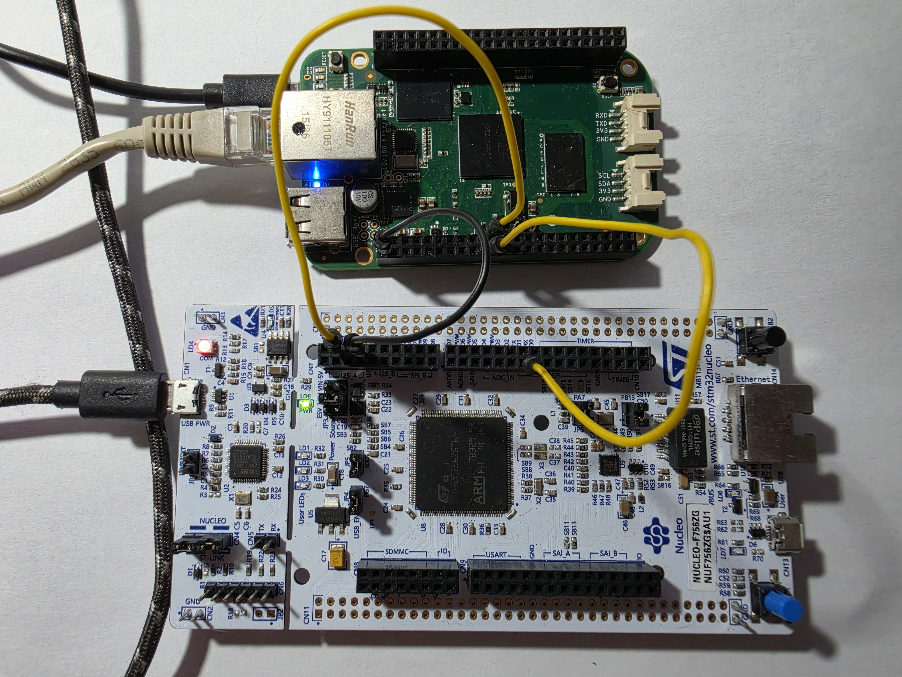
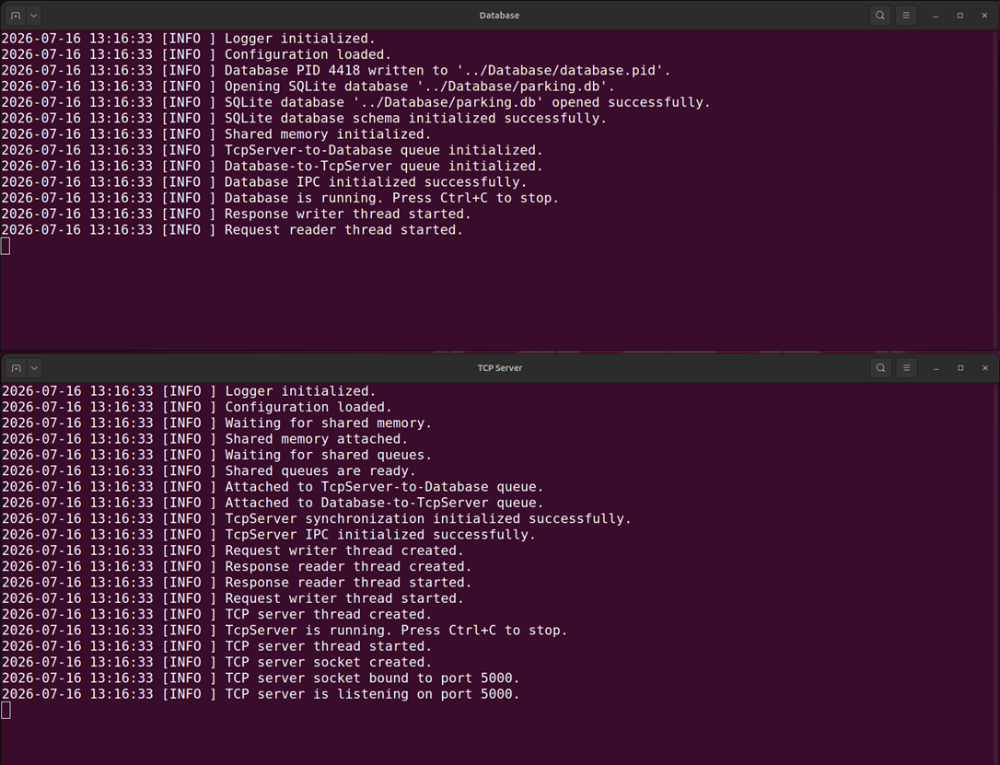
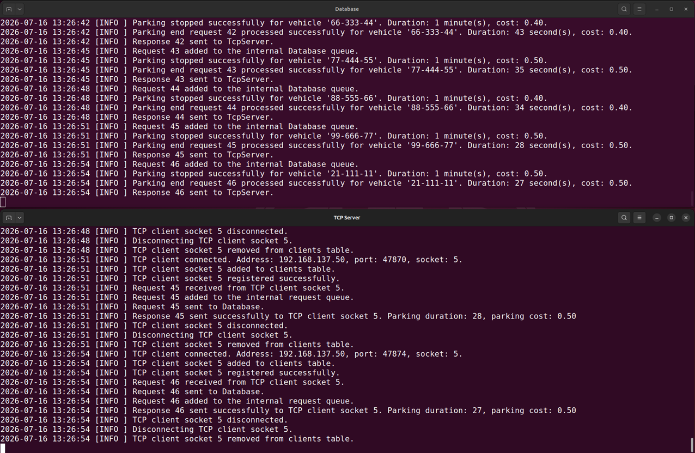
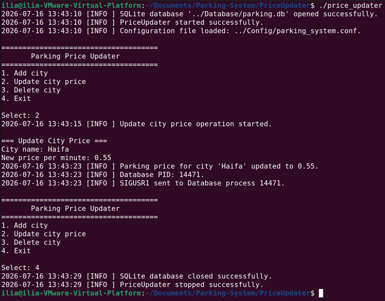
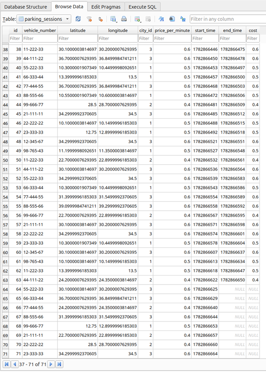
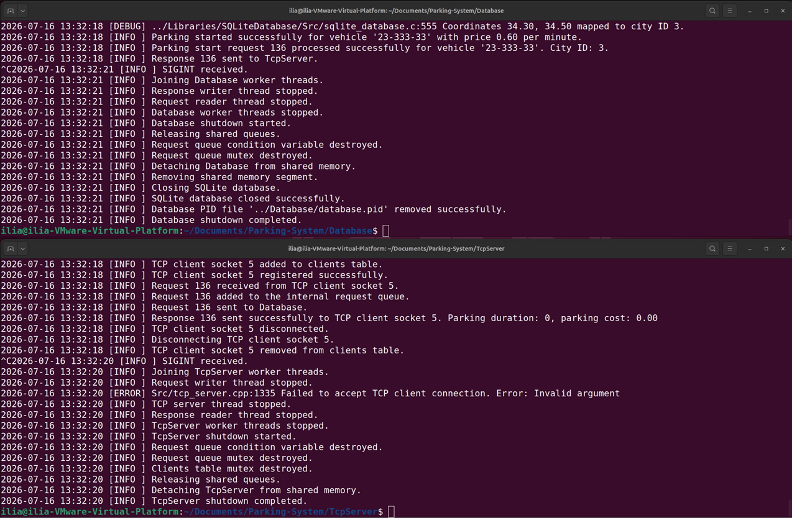
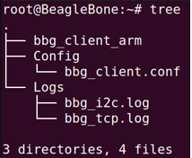
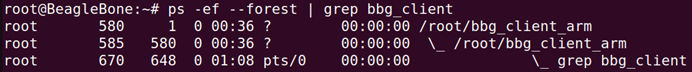

# Parking-System

## [Real Time College](https://rt-ed.co.il/) – a multi-disciplinary Real-Time O.S. and Embedded Software Solutions Center, providing consulting, development, integration, training, and support solutions.<br/>

## Linux Embedded Systems Final Project

The project developed as part of the Linux Embedded Systems course.
It implements a distributed parking management system built around BeagleBone Green, STM32, and Linux. It combines embedded firmware, multi-process applications, TCP/IP networking, inter-process communication (IPC), and an SQLite database into a complete end-to-end system.
The architecture consists of multiple independent applications communicating through TCP/IP, Shared Memory, unnamed pipes, I²C, and POSIX signals. The system demonstrates modular software design, multi-process programming, concurrent request processing, and integration between Embedded Linux and STM32 hardware.

---

## Project Goals

The main goal of the project is to design and implement a complete distributed system that integrates Embedded Linux applications with STM32 firmware.

The project demonstrates:

- communication between Linux and STM32 hardware;
- multi-process application design on BeagleBone Green;
- inter-process communication using shared memory, shared queues, unnamed pipes, and POSIX signals;
- multi-client TCP communication using an event-driven server;
- concurrent request processing with POSIX threads;
- persistent parking data management using SQLite;
- automatic application startup and supervision through `systemd`;
- reusable and modular software architecture in C and C++.

---

## Key Features

- Distributed architecture built around STM32, BeagleBone Green, and Linux
- STM32 GPS simulator operating as an interrupt-driven I²C slave
- BeagleBone Green client implemented as two cooperating Linux processes
- Unnamed pipe communication between the BBG I²C and TCP processes
- Automatic BBGClient startup through a `systemd` service
- Event-driven multi-client TCP server based on `select()`
- Bidirectional IPC through shared queues stored in System V shared memory
- Dedicated worker threads for network and database request processing
- SQLite-based parking city and parking session management
- Parking cost calculation based on the tariff active when a session starts
- Command-line utility for managing cities and parking prices
- Database notification through a PID file and `SIGUSR1`
- Centralized configuration and logging
- Graceful shutdown and controlled IPC resource cleanup

---

## Project Highlights

- Multi-process application architecture on BeagleBone Green (`fork()`)
- Event-driven multi-client TCP server based on `select()`
- Inter-process communication using Shared Memory, Shared Queues, unnamed pipes, and POSIX signals
- Multi-threaded request processing with POSIX Threads
- STM32 interrupt-driven I²C firmware using STM32 HAL
- SQLite database for parking city and parking session management
- Automatic service startup using `systemd`
- Modular architecture with reusable libraries shared across multiple applications

---

## System Architecture



The Parking-System is organized as a distributed Embedded Linux application consisting of several independent modules. Each module has a well-defined responsibility and communicates with other components through standardized interfaces, allowing the system to remain modular, scalable, and easy to maintain.

The BeagleBone Green acts as a gateway between the STM32 microcontroller and the Linux applications. Parking events generated by the STM32 GPS simulator are transferred over the I²C bus to the BBGClient. The BBGClient forwards the events to the TcpServer through a TCP connection. The TcpServer exchanges requests and responses with the Database process using shared memory and shared queues. Parking prices and session information are stored in an SQLite database. The PriceUpdater utility can modify parking tariffs directly in the database and notifies the Database process using a POSIX signal (`SIGUSR1`) to reload the updated pricing information without restarting the system.

---

## System Components

### [STM32GpsSimulator](STM32GpsSimulator/README.md)

Simulates a GPS receiver running on an STM32 NUCLEO board. The firmware operates as an interrupt-driven I²C slave and periodically updates GPS coordinates using a hardware timer.

### [BBGClient](BbgClient/README.md)

Runs on the BeagleBone Green as a `systemd` service. The application consists of two cooperating Linux processes connected by an unnamed pipe. One process communicates with the STM32 over I²C, while the other forwards parking events to the TcpServer over TCP/IP.

### [TcpServer](TcpServer/README.md)

An event-driven multi-client TCP server based on `select()`. It accepts parking events from multiple clients, forwards requests to the Database application through shared memory queues, and returns processing results to the originating clients.

### [Database](Database/README.md)

The central processing component of the system. It owns the IPC infrastructure, manages the SQLite database, processes parking requests, calculates parking costs, and returns responses through shared memory queues.

### [PriceUpdater](PriceUpdater/README.md)

Administrative command-line utility for managing parking cities and parking tariffs. After updating the SQLite database, it notifies the Database process using `SIGUSR1` to reload pricing information without restarting the system.

### Reusable Libraries

#### [Config](Libraries/Config/README.md)

Loads application settings from configuration files and provides string and integer access by key.

#### [Logger](Libraries/Logger/README.md)

Provides a common thread-safe logging interface with file and optional console output.

#### [SQLiteDatabase](Libraries/SQLiteDatabase/README.md)

Encapsulates SQLite operations for city management, parking sessions, and parking cost calculation.

#### [SharedMemory](Libraries/SharedMemory/README.md)

Provides a C++ abstraction over System V shared memory and serves as the storage layer for shared IPC structures.

#### [SharedQueue](Libraries/Queue/README.md)

Implements fixed-size FIFO queues directly inside shared memory for inter-process communication.

#### [IpcProtocol](Libraries/IpcProtocol/README.md)

Defines shared message structures, protocol constants, queue layout, and IPC metadata used by TcpServer and Database.

---

## Hardware Platform

The project was developed and tested using real embedded hardware. The STM32 NUCLEO-144 development board with the STM32F756ZG MCU simulates GPS events and communicates with the BeagleBone Green over the I²C bus. The BeagleBone Green runs the Embedded Linux applications responsible for communication, request processing, and database management.

**Hardware Components**

- **BeagleBone Green** — Embedded Linux platform
- **STM32 NUCLEO-144 development board (STM32F756ZG)** — GPS simulator and I²C slave

---

## Technologies

| Category | Technologies |
|----------|--------------|
| Languages | C11, C++17 |
| Embedded Platforms | STM32 HAL, Embedded Linux |
| Operating Systems | Ubuntu 24.04 LTS, Debian 13.5 (BeagleBone Green) |
| Development Tools | STM32CubeIDE, STM32CubeMX, Visual Studio Code |
| Compiler Toolchains | GCC, GNU Arm Embedded Toolchain, GNU ARM Cross Compiler (arm-linux-gnueabihf) |
| Networking | TCP/IP |
| IPC | System V Shared Memory, Shared Queues, Unnamed Pipes, POSIX Signals |
| Concurrency & Synchronization | POSIX Threads, Mutexes, Condition Variables, POSIX Semaphores |
| Event Handling | `select()` |
| Database | SQLite |
| System | `systemd` |
| Documentation | Doxygen |
| Build | GNU Make |
| Version Control | Git |

---

## Project Demonstration

### Hardware Setup

The project was developed and tested on real embedded hardware. The STM32 NUCLEO-144 development board with the STM32F756ZG MCU simulates GPS events and communicates with the BeagleBone Green over the I²C bus.



### System Startup

The Database and TcpServer applications initialize the shared memory region, shared queues, worker threads, SQLite database, and network resources before entering the main processing loop.



### Runtime Operation

During normal operation, parking events generated by the STM32 simulator are delivered through the complete software stack. TcpServer receives requests from the BBGClient, forwards them to the Database through shared memory, and returns the calculated parking information to the client.



### Dynamic Price Update

Parking prices can be modified while the system is running. The PriceUpdater updates the SQLite database and sends `SIGUSR1` to the Database process, allowing the updated pricing information to be reloaded without restarting the application.



### Parking Session Database

Each parking event is stored in the SQLite database together with its GPS coordinates, detected city, parking duration, and calculated cost. Active parking sessions remain open until the corresponding vehicle leaves the parking area.



### Graceful Shutdown

The applications terminate cleanly by stopping worker threads, releasing shared memory resources, closing the SQLite database, and removing temporary IPC objects before exiting.



### BBGClient Deployment

The BBGClient is deployed as a `systemd` service. During startup it creates two cooperating Linux processes connected through an unnamed pipe. The directory structure and process hierarchy on the BeagleBone Green are shown below.





---

## Project Structure

```text
Parking-System
│
├── STM32GpsSimulator      # STM32 GPS simulator firmware (HAL, C)
├── BBGClient              # BeagleBone Green multi-process client
├── TcpServer              # Event-driven multi-client TCP server
├── Database               # Parking processing and IPC owner
├── PriceUpdater           # Administrative CLI utility
│
├── Libraries
│   ├── Config             # Configuration file parser
│   ├── Logger             # Thread-safe logging library
│   ├── SQLiteDatabase     # SQLite access and parking database logic
│   ├── SharedMemory       # System V shared memory abstraction
│   ├── SharedQueue        # FIFO queues stored inside shared memory
│   └── IpcProtocol        # Shared IPC message and layout definitions
│
├── Docs                   # Project documentation and images
└── start_system.sh        # Starts the Linux-side applications
```

---

## Building the Project

The Linux applications are built using GNU Make.

### Native Linux Applications

`TcpServer`, `Database`, and `PriceUpdater` are compiled natively on Ubuntu.

Example:

```bash
cd TcpServer
make
```

The same build procedure applies to the other native Linux applications.

### BBGClient

`BBGClient` is cross-compiled on Ubuntu for the ARM architecture used by the BeagleBone Green.

Example:

```bash
cd BBGClient
make -f Makefile.arm
```

The resulting executable is transferred to the BeagleBone Green using `scp`.

### Reusable Libraries

The reusable libraries are compiled and linked automatically as part of the applications that use them. They do not normally need to be built separately.

### STM32GpsSimulator

The STM32 firmware is built and flashed using STM32CubeIDE.

---

## Running the System

The Linux applications can be started using the provided startup script:

```bash
./start_system.sh
```

Alternatively, the applications can be started manually in the following order:

1. `Database`
2. `TcpServer`

The `BBGClient` runs as a `systemd` service on the BeagleBone Green.

Finally, flash and run the `STM32GpsSimulator` firmware on the STM32 NUCLEO-144 development board.

Once all components are running, the STM32 simulator begins generating GPS events automatically.

The `PriceUpdater` utility can be executed at any time to add or remove cities, modify parking tariffs, and notify the `Database` process about configuration changes.

---

## Documentation

Detailed documentation is available in the README files of each module.

- STM32GpsSimulator
- BBGClient
- TcpServer
- Database
- PriceUpdater
- Libraries

Additional project documentation, architecture diagrams, and images are available in the `Docs` directory.

